# Quad: Project Explainer
### Everything campus, one place.

---

# Team members:
 - Rayan Mamhoud (F25040223)
 - Rayan Ait Rahhout (F25130312)

> **Live deployment:** Quad is fully cloud-hosted and accessible at [https://quad-os.vercel.app](https://quad-os.vercel.app)
>
> **GitHub repository:** [https://github.com/ryanneekidev/quad-os](https://github.com/ryanneekidev/quad-os)

---

> ## ⚠ Important Notice: Demo Data
>
> **All data, content, and information displayed within this application is entirely fictitious and has been created solely for demonstration and hackathon evaluation purposes.**
>
> This includes but is not limited to: course names, assignment titles, scholarship listings, club names and descriptions, event details, marketplace listings, transaction records, and budget figures. No real personal, financial, or academic data has been used at any point.
>
> Quad is presented here as a proof of concept. If the platform were to be deployed for real use at a specific university, all seed data and defaults would be replaced to reflect that institution's context: local currency, real course codes and department names, campus-specific clubs and events, and region-appropriate scholarship providers. The architecture is designed to support this kind of contextual adaptation with minimal changes.

---

## Introduction

University students today manage their academic lives across a fragmented collection of tools: a calendar app for deadlines, a spreadsheet for budgets, a group chat for clubs, a separate marketplace for selling textbooks. None of these tools talk to each other, and none of them understand the context of being a student.

**Quad** is a unified student life operating system built to replace all of them. Named after the physical quad at the centre of campus (the place where every aspect of student life converges), it is structured around four interlocking pillars: **Academic**, **Finance**, **Social**, and **Marketplace**.

The core insight behind Quad is not that students need better individual tools, but that they need a platform where those tools are aware of each other. When you upload a lecture PDF, Quad can turn it into flashcards. When you list a textbook for sale and it sells, the income appears in your budget automatically. When your study group decides to meet at a café, you can split the cost in two taps. These connections are what make Quad genuinely useful rather than just another productivity app.

---

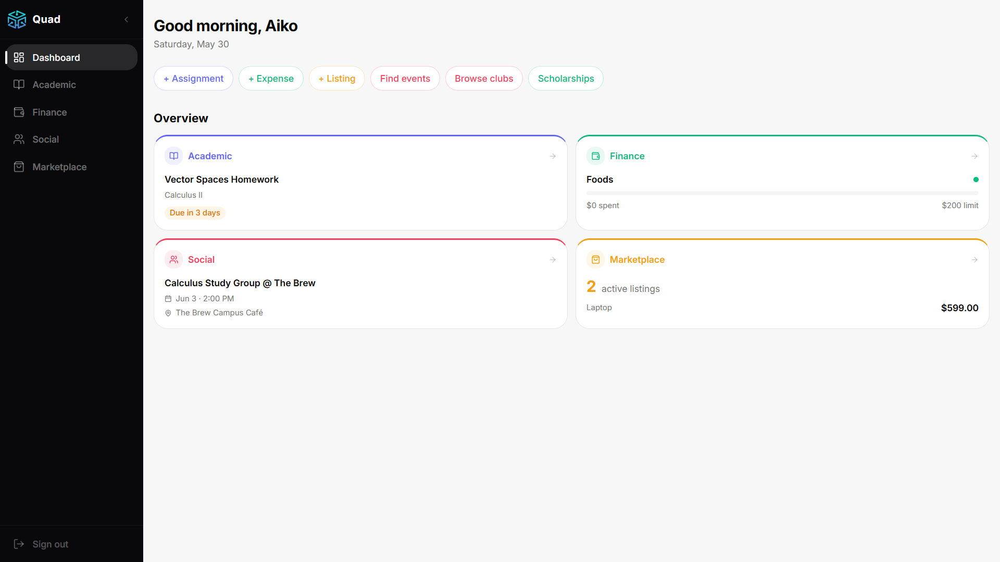

---

## The Four Pillars

### Academic

The Academic pillar is the intellectual core of the platform. It starts with course and assignment management: students add their courses, log assignments with due dates and grade weights, and track their scores as the semester progresses. From this data, Quad computes a live weighted GPA and projects how scores on upcoming work will affect the final grade via a what-if slider.

Beyond tracking, Academic has two AI-powered features. The **Study Planner** takes a student's list of pending assignments and their available study hours per day, and asks Claude to produce a realistic day-by-day schedule prioritised by deadline urgency and assignment weight. The **Flashcard Generator** lets students upload a PDF or paste their notes, and Claude extracts the key concepts into up to 20 front/back cards, which can then be reviewed in a swipeable confidence-tracking interface (cards with low confidence surface more often).

The pillar also includes a **Resource Library**, a per-course store for PDFs, links, and notes, with a direct bridge to the Marketplace: any resource can be listed for sale in one click.

---

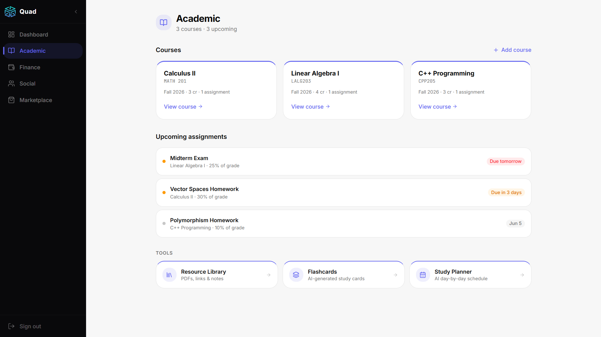

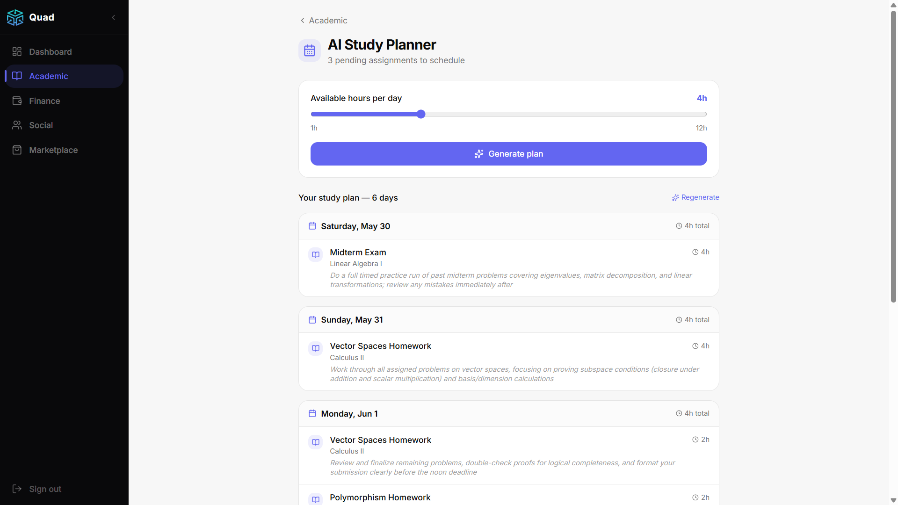

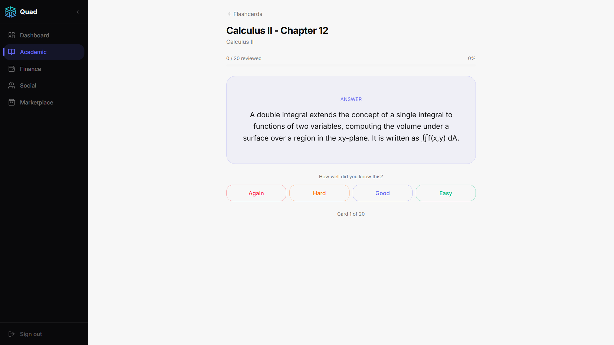

---

### Finance

The Finance pillar gives students a clear picture of where their money goes and where it could come from. Students define monthly budget categories (rent, food, transport, entertainment) with spending limits, then log transactions against those categories. Each category shows a live progress bar: green below 75%, amber approaching the limit, red over budget.

The **AI Spending Insights** feature sends the last 30 days of transactions to Claude, which returns a short, friendly analysis with three concrete tips tailored to student spending patterns. It deliberately avoids a judgmental tone; the goal is to help, not lecture.

The **Scholarship Finder** is seeded with realistic scholarship entries and uses Claude to match them against the student's profile (major, GPA, year of study). Scholarships with deadlines within two weeks are flagged with an alert. There is also a cross-pillar trigger: when a student's computed GPA crosses 3.5 on the Academic page, a banner appears prompting them to check their scholarship matches.

The **Bill Splitter** lets students create a shared expense, add participants from within the platform, assign amounts (equal or custom), and mark individual shares as settled. Settlement automatically creates the corresponding income or expense transaction in the budget tracker. Events in the Social pillar that carry a cost have a direct "Split cost" button that pre-fills a bill with the event's title and per-person amount.

---

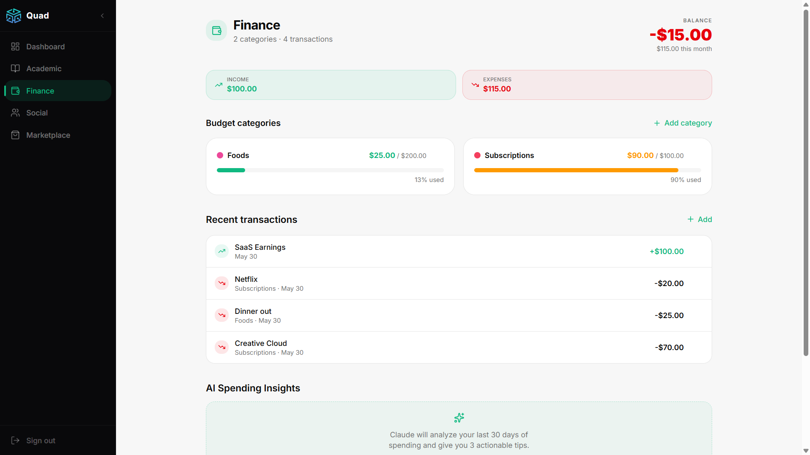

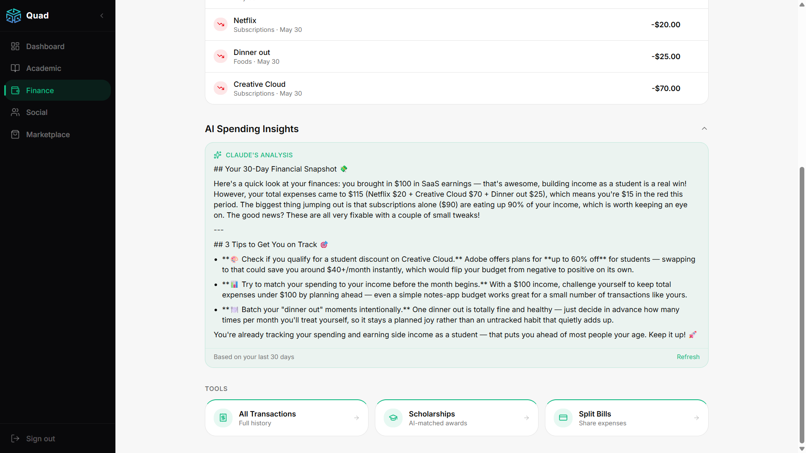

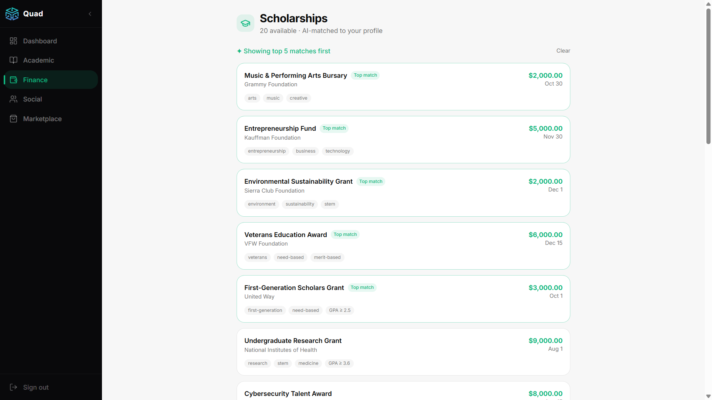

---

### Social

The Social pillar is the campus community layer. The **Club Directory** lists all campus clubs, searchable and filterable by category. Students join or leave clubs, and an AI matcher (powered by Claude) suggests the top five most relevant clubs based on their major and profile. Joined clubs appear as chips on the main Social page for quick access.

The **Event Board** is a feed of upcoming events, posted by clubs or individual students. Each event shows the title, date, location, and RSVP count. Students RSVP with one tap. Events with an associated cost display a "Split cost" button that bridges directly to the Finance bill splitter.

The **Study Session Board** lets students post a study session linked to one of their own courses, set a location, time, and participant cap. Other students can browse and join open sessions. The cross-pillar link to Academic means the course selector in the form pulls from the student's own course list, keeping sessions relevant.

---

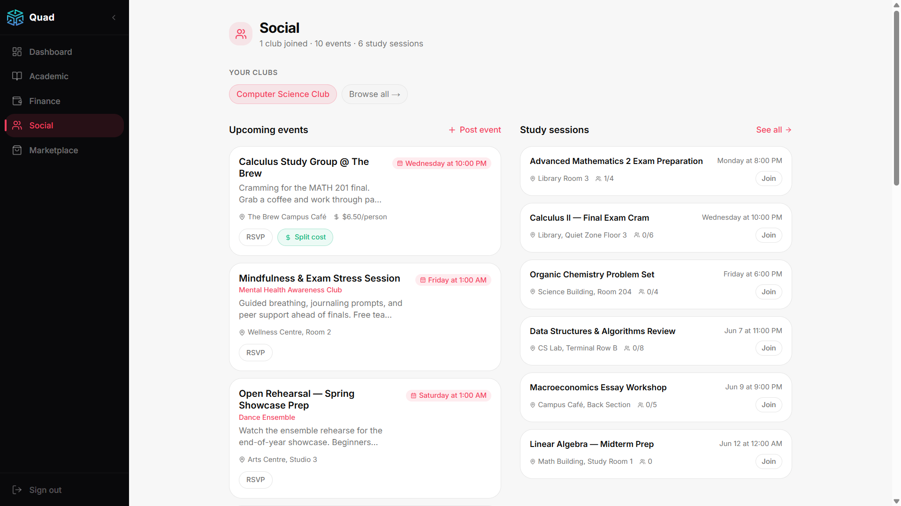

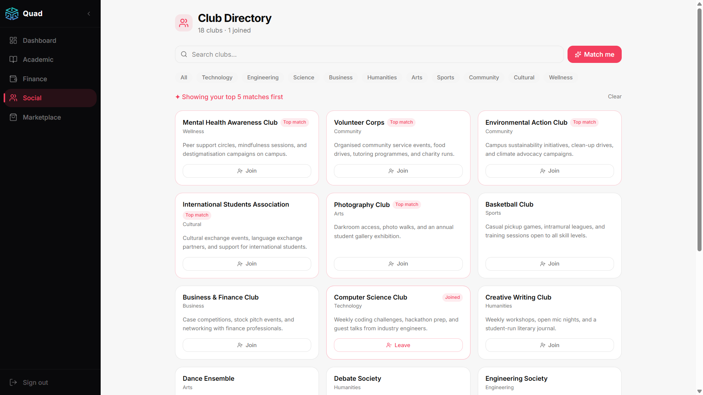

---

### Marketplace

The Marketplace pillar is a lightweight campus buy-and-sell board. Students create listings with a title, description, price, condition, category, and optional image. The **AI Price Suggester**, triggered by a small "AI suggest" button next to the price field, sends the item name and condition to Claude, which responds with a realistic min/max price range and a one-sentence explanation drawn from what such items typically sell for in student marketplaces.

The listings feed has search and category filtering. Each listing detail page shows the full item information and an **in-app chat** powered by Supabase Realtime, so buyers and sellers can message each other directly without leaving the platform.

When a seller marks their listing as sold, an income transaction is automatically created in their Finance budget tracker with no manual entry needed. From the Academic resource library, a "Sell this" button on any resource pre-fills a new listing form with the resource's title and the "Textbook" category already set.

---

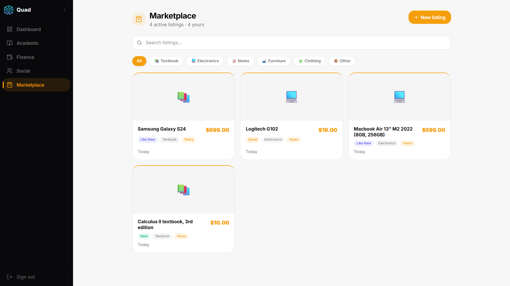

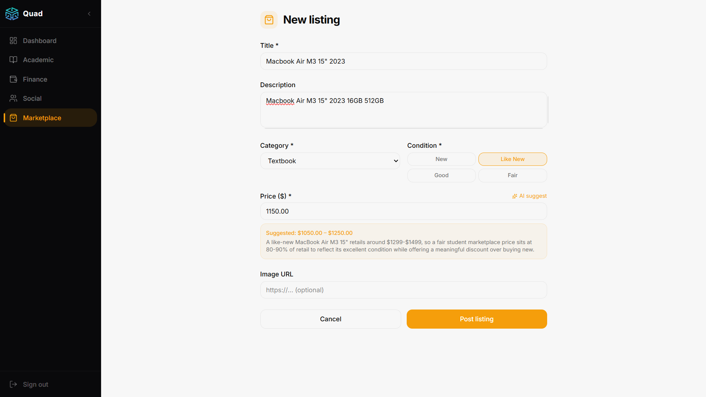

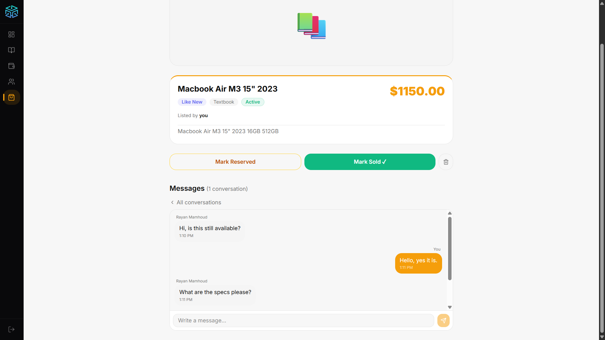

---

## The Cross-Pillar Threads

The features above would make Quad a competent collection of tools. What makes it a platform is the connections between them. These are not deep integrations requiring complex infrastructure; they are small, deliberate moments where one pillar knows about another.

| Thread | Where it starts | Where it lands |
|---|---|---|
| Sell a resource | Academic resource library, "Sell this" | Pre-filled Marketplace listing |
| Listing sold | Marketplace, Mark as Sold | Income transaction in Finance |
| Event with cost | Social event card, "Split cost" | Pre-filled Finance bill |
| GPA milestone | Academic GPA crosses 3.5 | Scholarship alert on Academic page |

---

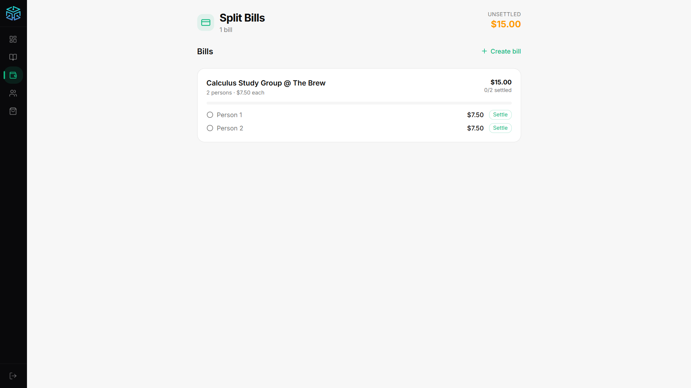

---

## Mobile Experience

Quad is designed to be used on a phone. The navigation collapses into a fixed bottom tab bar on mobile, with the same pillar accent colours as the desktop sidebar. All pages are single-column on narrow screens. The marketplace listings, club cards, and event feed reflow to a vertical stack. The quick actions on the dashboard home scroll horizontally without disrupting the page layout.

---

<table>
  <tr>
    <td>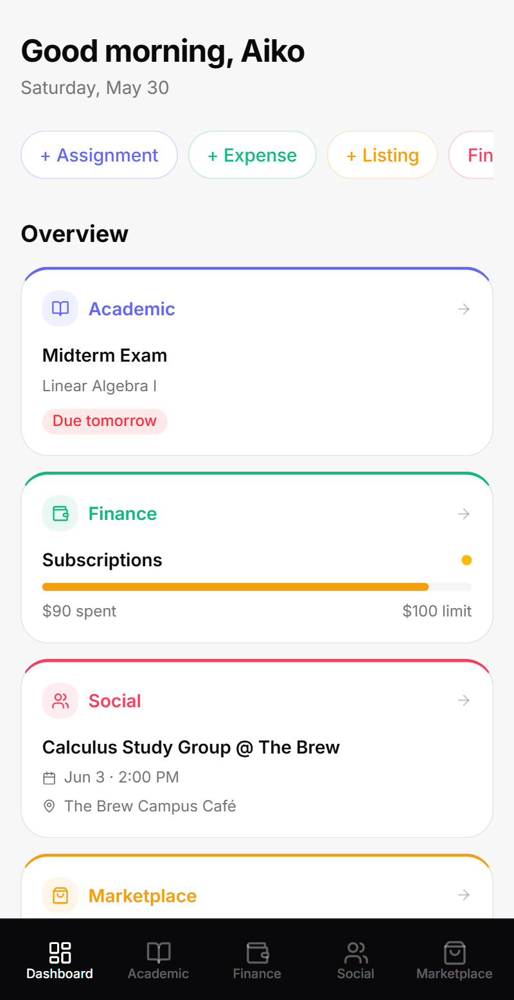</td>
    <td>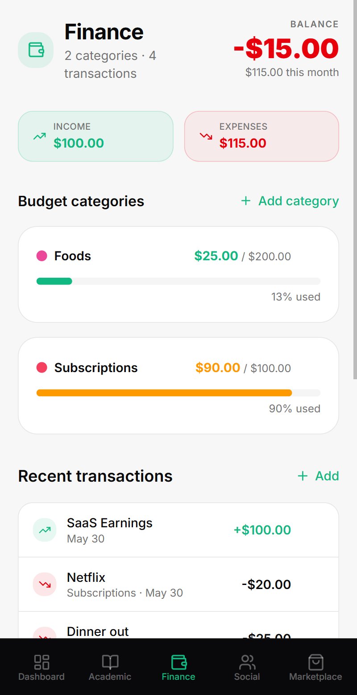</td>
  </tr>
</table>

---

## Technical Architecture

### Stack choices

**Next.js 16 with the App Router** was chosen for its file-system routing, React Server Components (data fetching happens on the server, reducing client bundle size), and zero-config Vercel deployment. Pages that need interactivity such as forms, modals, and real-time chat are client components; everything else is server-rendered.

**Supabase** handles authentication, the Postgres database, file storage, and real-time subscriptions, all from a single service with a generous free tier. Using Supabase's server-side client in Next.js server components means database queries happen server-side, and the service role key never reaches the browser. Row-Level Security policies on the database ensure users can only access their own data.

**Tailwind CSS v4 + shadcn/ui** provided a complete design system without imposing a rigid component structure. The pillar accent colours (Academic: indigo, Finance: emerald, Social: rose, Marketplace: amber) are CSS custom properties threaded through the entire design.

**Anthropic's Claude API** (`claude-sonnet-4-6`) powers six distinct AI features. All calls are routed through a single Next.js API route (`/api/ai`) with an `action` discriminator, keeping the API key server-side and making it trivial to add new AI capabilities.

### Data model

The database is a standard relational Postgres schema. The key design decision was treating the four pillars as first-class tables with explicit foreign keys for cross-pillar relationships:

- `listings.resource_id` references `resources.id` (Marketplace and Academic)
- `split_bills.event_id` references `events.id` (Finance and Social)
- `transactions.source` carries a `marketplace_sale` value to distinguish auto-created income from manual entries
- `study_sessions.course_id` references `courses.id` (Social and Academic)

### AI integration pattern

Every Claude call follows the same structure: a server-side API route receives a JSON body with an `action` string and the relevant data, constructs a precise prompt, calls the Anthropic SDK, and returns structured JSON. Prompts ask Claude to respond in a specific JSON shape and include a system prompt that enforces this. A small `extractJSON` utility strips any markdown fences from the response before parsing, making the calls robust to minor model output variation.

```
Client  -->  POST /api/ai { action, ...data }
             --> Claude API (server only)
             --> Structured JSON response
             --> Client renders result
```

### Authentication and security

Supabase Auth handles session management via HTTP-only cookies (using `@supabase/ssr`). A Next.js middleware file checks the session on every request to dashboard routes and redirects unauthenticated users to the login page. The Supabase admin client (service role) is only instantiated server-side for operations that need to read user metadata such as display names in the listing chat.

---

## Design Philosophy

The visual language of Quad follows a small set of principles applied consistently:

- **Pillar colour as signal.** Each pillar has a single accent colour used for its icon, card border accent, active nav state, focus rings, and key data values. Users quickly learn to associate indigo with academic work and emerald with finance.
- **Cards that float.** A slightly off-white page background combined with pure-white cards creates a subtle depth that makes the layout feel structured without being heavy.
- **Dark navigation.** The sidebar uses a near-black background that makes the four accent colours pop against it. On mobile, the bottom tab bar carries the same treatment.
- **Inline AI, not chatbot UI.** AI results appear inline: as a generated plan, a list of cards, an insight box, rather than in a separate chat interface. The AI is a feature of the page, not a destination.
- **Mobile-first.** Every component was designed at 375px first. The dashboard grid is a single column on mobile. The quick actions are a horizontally scrolling strip. Navigation is a bottom tab bar.

---

## Closing

Quad was built in one continuous sprint from scratch: database schema, authentication, all four pillars, AI integration, cross-pillar logic, and a full UI overhaul, as a demonstration of what a modern student platform could look like if it were designed with AI and data interconnection at its core from the beginning.

The demo flow tells the full story in under four minutes: a student adds their courses, uploads a lecture PDF to generate flashcards, checks their GPA, sees a scholarship alert, analyses their spending, RSVPs to a study group event and splits the cost with friends, then sells last semester's textbook from the resource library and watches the income appear in their budget automatically.

Every feature works end to end. Every cross-pillar connection is live.

---

*Quad: built for students, by a student.*
